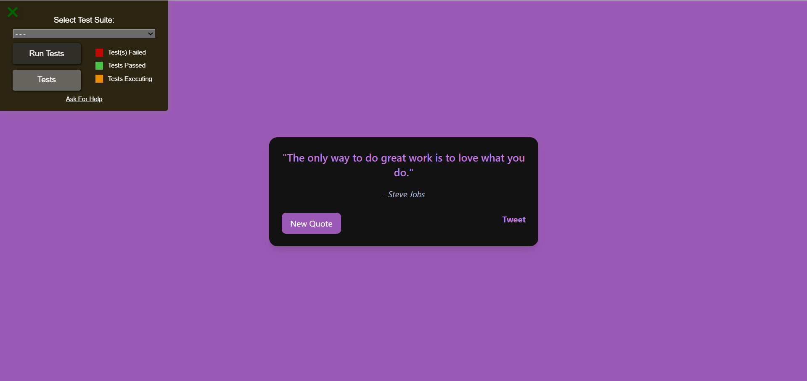

# 🎲 Random Quote Machine

Aplikasi **Random Quote Machine** sederhana yang dibangun dengan **React (via CDN)** + **TailwindCSS**.  
Proyek ini merupakan implementasi dari [FreeCodeCamp Frontend Libraries Project](https://www.freecodecamp.org/learn/front-end-development-libraries/#front-end-development-libraries-projects).  

✨ Fitur:
- Menampilkan kutipan acak beserta penulisnya.
- Ganti kutipan baru dengan tombol **New Quote**.
- Bagikan kutipan ke Twitter dengan sekali klik.
- Efek transisi warna background yang dinamis setiap ganti kutipan.
- Desain responsif dengan **TailwindCSS**.

---

## 🚀 Demo
👉 [Lihat Live Demo di GitHub Pages](https://ddekaee.github.io/quotesrandom/)  

---

## 🛠️ Teknologi yang digunakan
- [React 18](https://react.dev/) (via CDN, tanpa build tools)
- [TailwindCSS](https://tailwindcss.com/)
- [FreeCodeCamp Test Suite](https://cdn.freecodecamp.org/testable-projects-fcc/v1/bundle.js)

---

## 📸 Preview


---

## 📦 Cara Menjalankan
1. Clone repo ini:
   ```bash
   git clone https://github.com/ddekaee/quotesrandom.git
Buka file index.html di browser.

Selesai ✅
